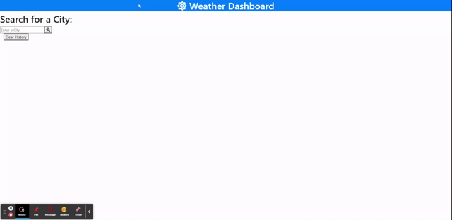

# Weather Dashboard

## Deployment

- [GitHub Repository](https://github.com/cn-kp/Weather-Dashboard)
- [GitHub Deployed Link](https://cn-kp.github.io/Weather-Dashboard/)

## Description

This application is created to aid the user in finding weather forecast information for the next 5 days for a particular city. The user is required to enter a city that they want weather information on and the page will respond by fetching the required API and displaying the forecast on the page.

Upon clicking the search icon, the city will also be appended to the history tab just below the search bar, allowing the user to quickly research that city. If the history is no longer needed, the user also has the option to clear all local history through the button beneath the history named "clear history" 

The program is simplistic and intuitive to use.

## Features

- Search Option
- Local Hstory
- Display Elements

## Third Party Libraries

- BootStrap 
- Jquery
- Moment Js
- Font Awesome
- Open Weather API's

## Installation

To install this program all you need is a text editior. I would recommend Visual Studio Code. then download or clone the repository of the program

## Demonstration

## Credits

This application was created by kevin, with the help of my TA's
